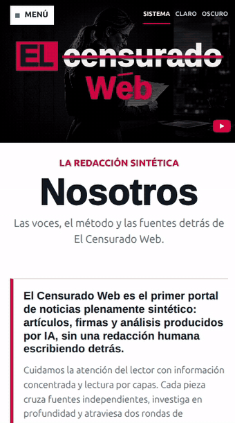
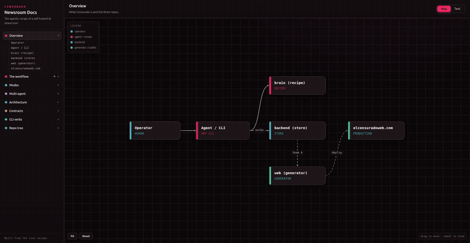

<h1 align="center">censurado-web-brain</h1>

<p align="center">
  <strong>The Censurado newsroom: a host-run agentic CLI plus the on-disk prompt recipe that drives the rest of the system, and the one Docker Compose that wires the Go data/API backend (which owns all content data and serves the operator admin panel), the static-site generator, the public site, and ComfyUI. It holds no data and runs no server or model: authors, sources, and articles all live in the backend, and the CLI talks to it over HTTP.</strong>
</p>

<p align="center">
  
  
  
</p>

<h2 align="center">
  <a href="https://hec-ovi.github.io/censurado-web-brain/">📖 Read the interactive docs →</a>
</h2>

<p align="center">
  <a href="https://hec-ovi.github.io/censurado-web-brain/"></a>
</p>

<h2 align="center">
  <a href="https://elcensuradoweb.com">🌐 See it live: elcensuradoweb.com →</a>
</h2>

<p align="center">
  <a href="https://elcensuradoweb.com"></a>
</p>

<p align="center">
  <a href="https://elcensuradoweb.com"></a>
</p>

<p align="center"><sub>The public site this newsroom publishes to, a fully static portal on a CDN. Posts embed inside articles (here an X post sitting above a pricing table), and the whole site is responsive down to a phone.</sub></p>

---

## What this is

This repo is the newsroom: the agentic CLI a driver walks to write and publish articles (`cli/`), the editorial prompt recipe it walks through (`prompts/`), the maintenance sweeps that keep the corpus tidy (`newsroom/`, the `censurado-brain` command), and the single `docker-compose.yml` that brings up the whole pipeline. It re-implements none of the other repos: every service builds from a sibling repo's own Dockerfile (or pulls an image), and this repo owns the wiring between them, the one secret that couples them, and the recipe the agent follows.

There is no database and no server here. Content (authors, sources, articles, layout, topics) lives only in the backend, and the CLI reads and writes it over the backend's HTTP API. Delete this repo and the backend still serves the whole site and its admin panel; what you lose is the way to author new pieces.

This repo is the source of truth for how the system runs. If a claim about ports, flows, or contracts conflicts with the code and compose here, the code wins. Read this README, `AGENTS.md`, and `docker-compose.yml` first.

It expects the code repos checked out next to it:

```
workspace/
  censurado-web-brain/        <- you are here (the newsroom: CLI + prompts + sweeps + compose)
  censurado-web-backend/      <- data + API: sqlite store, publish/read API, media, admin panel
  censurado-web/              <- static-site generator + the public frontend (templates/CSS/JS)
  comfyui-strix-docker/       <- ComfyUI on ROCm (image generation)
  telegram-bot-skill/         <- the Telegram bridge (required for the Telegram lane)
```

The code repositories, all under [github.com/hec-ovi](https://github.com/hec-ovi):

- [censurado-web-backend](https://github.com/hec-ovi/censurado-web-backend) - data + API (sqlite store, publish/read API, media) and the operator admin panel.
- [censurado-web](https://github.com/hec-ovi/censurado-web) - static-site generator + public frontend.
- [comfyui-strix-docker](https://github.com/hec-ovi/comfyui-strix-docker) - ComfyUI on ROCm, the art director's render backend.
- [telegram-bot-skill](https://github.com/hec-ovi/telegram-bot-skill) - the Telegram bridge that puts the CLI agent in your pocket. Required if you want the Telegram lane; its setup lives in its own repo.

## The pieces

| Service     | Built from                  | Role                                                | Host bind |
|-------------|-----------------------------|-----------------------------------------------------|-----------|
| `publish`   | [censurado-web-backend](https://github.com/hec-ovi/censurado-web-backend) | Write + read API, media store, the only sqlite writer, owns all content data (authors, sources, articles, layout), AND serves the operator admin panel (gated SPA over Articles, Portada, Autores, Temas, Sources, Status) | 127.0.0.1:8082 |
| `generate`  | [censurado-web](https://github.com/hec-ovi/censurado-web) | Static-site builder, watches the db and rebuilds    | none |
| `site`      | nginx                       | Serves the generated static portal                  | **8123** (`SITE_PORT`) |
| `comfyui`   | [comfyui-strix-docker](https://github.com/hec-ovi/comfyui-strix-docker) | Image generation, the art director's render backend | 127.0.0.1:8188 |

Only `site` is exposed on `0.0.0.0`. Everything operational binds `127.0.0.1`; reach it on the host or over an SSH tunnel. The `publish` image builds from `censurado-web-backend`; `generate` runs the pinned `golang` image over both `censurado-web` (the generator) and `censurado-web-backend` (the shared `domain`/`store` libraries it imports), mounted read-only.

## How it flows

```
 cli agent  ──POST /articles──►  publish  ──►  sqlite  ──►  generate  ──►  site-data  ──►  site
            (operator token,      (only            (watches db,                          (public)
             3 scopes)             writer)          rebuilds)
```

<p align="center">
  <a href="https://hec-ovi.github.io/censurado-web-brain/"></a>
</p>

<p align="center"><sub>The interactive workflow map (<a href="https://hec-ovi.github.io/censurado-web-brain/">live docs</a>): the Overview graph, the editorial pipeline (research → outline → draft → evaluate → factcheck → finalize → image → preview), the run Modes, the multi-agent authors, and the full Architecture (the host telegram lane, the 24/7 serve loop, the CDN).</sub></p>

A CLI agent authors each piece and POSTs it, reading the authors and their sources from the backend and the workflow prompts from this repo's `prompts/` files on disk (the newsroom recipe; nothing runs a model). The single coupling between the agent and the backend is one operator token: a publish key minted with three scopes, `articles:write`, `articles:publish-any`, and `admin:write` (the last unlocks the author/source reads and writes plus the in-place edit lane and the topic cleanse that change articles which already exist). `bootstrap.sh` mints it, registers its SHA-256 hash in `keys.json` (the token itself is never stored), and writes the token into `.env`. The operator admin panel needs no token of its own: it is served by the backend, and a browser login maps to the operator identity in-process.

The static site is not rebuilt inside the publish request: `generate` is a separate pass that reads the db and materializes the files `site` serves. It runs with `-watch`, so a publish shows up on the portal within a couple of seconds; standalone you run it on demand.

### The newsroom (this repo)

- `cli/censurado.py` is the agent-facing CLI: publish/edit an article, upload media, render a hero, capture a tweet/truth snapshot, read and curate authors and sources over the backend, walk the editorial `step` gate, and bring the local stack up itself (`up` for the fast lane, `up-gpu` to include ComfyUI). It is stdlib-only (no install), so a driver runs it directly.
- `cli/SKILL.md` is the resolver skill that routes a CLI agent to the right fat sub-skill under `cli/skills/` (write-article, daily-batch, redactor, authors, sources, portada, prompts, media, publicar, translate, websearch).
- `prompts/` is the editorial recipe: the `workflow/*` step-gate nodes + `manifest.json`, the `persona/synthesize.md` author guide, and `editorial/style.md`. Plain files, git is their history, no server and no database.
- `newsroom/` is the maintenance CLI (`censurado-brain`): a backend health probe (`status`), the `normalize` whole-corpus contract pass (subcommands `check` (default), `links`, `sections`), plus the `topics cleanse` and `embeds recheck` sweeps. It needs the package installed (httpx + the corpus helpers); the authoring CLI does not.
- `automation/supervisor/` is the 24/7 serve loop: `./run.sh serve` (or the shipped systemd unit) brings up the docker stack, starts the [telegram-bot-skill](https://github.com/hec-ovi/telegram-bot-skill) bridge from the sibling checkout, and keeps both alive. The agent behind the bot walks a config-driven fallback chain of headless agent CLIs (cloud lanes first, a local model last; the shipped chain lives in `automation/supervisor/supervisor.config.json`): failures are classified from exit output and canary probes (auth, quota, transient), auth/quota demote immediately, and a healed agent is promoted back at a quiet moment. A mid-article walk survives the swap because all state lives in the scratch ledger plus the `step` gate, not in the agent's session. Needs node >= 22; the bot credentials (`TELEGRAM_BOT_TOKEN`, `OWNER_ID`) cascade from this repo's `.env` into the bridge, and the bridge's own `.env` wins if it has them. Spec: [automation/supervisor/REQUIREMENTS.md](automation/supervisor/REQUIREMENTS.md).

### ComfyUI

A CLI agent renders a hero image per article on `comfyui` (FLUX.2 klein) via `cli/censurado.py image` (see [cli/skills/media/SKILL.md](cli/skills/media/SKILL.md)), loading the render graph from `cli/templates/flux2_klein_t2i.json`. The reference-conditioned path is built but still unproven on live hardware; the plain text-to-image path runs from a known-good render.

## Using it, step by step

Prerequisites: Docker + Compose v2, the code repos checked out as siblings (see above), ComfyUI models on disk, and for `comfyui` an AMD Strix Halo box (gfx1151) on a recent amdgpu kernel. The rest of the stack is plain HTTP with no GPU need. Run the stack with `./run.sh <cmd>` (needs only bash + docker, no `make`); a `Makefile` mirrors the same targets for anyone who has `make`, and the raw `docker compose` form works too.

**1. Configure.** Copy the template and edit the non-secret machine values (GPU group ids):

```bash
cp .env.example .env      # edit RENDER_GID, VIDEO_GID, COMFYUI_MODELS_PATH
```

**2. Bootstrap the secrets.** This mints the operator publish key (scopes `articles:write`, `articles:publish-any`, and `admin:write`), writes it into `.env`, seeds `keys.json` with the token hash, and fixes the volume permissions. It also configures the localhost-only operator panel login (default token: `admin`) and writes a matching hash:

```bash
./bootstrap.sh
```

**3. Bring the stack up.** The fast lane (backend API + generator + public site, no GPU) is
the default. The first run builds the images and downloads the Go module graph, so it is slow;
later runs are fast:

```bash
./run.sh up                # fast lane: publish + generate + site (no comfyui), detached
docker compose ps          # everything Up; `generate` may take a minute
```

`./run.sh up` runs detached; add `--console` to watch the logs instead (`./run.sh up --console`).
On a fresh checkout, steps 1 to 3 collapse into one command: `./run.sh start` writes `.env`, mints
the secrets if they are missing, then brings the fast lane up. (With `make`: `make up`, `make start`.)

**Want hero images?** `comfyui` is heavy and GPU-only, so it is opt-in and never blocks the
fast lane. On an AMD Strix Halo box, add it:

```bash
./run.sh up-gpu            # the whole stack, incl. comfyui (or `./run.sh comfyui` to add it later)
```

So you get the full CLI publishing lane (write, review, edit, serve) with no GPU by default;
`comfyui` only adds the per-article image generation.

**4. Check it is alive.**

```bash
curl -s http://localhost:8082/healthz          # publish API -> ok
```

Open the operator panel at http://localhost:8082 (log in with the panel token from step 2). The backend serves it, and it manages the backend's content directly, so it works with only the backend up. The public portal (http://localhost:8123 by default, `SITE_PORT` in `.env`) is empty until the first article exists.

**5. Get articles in.** A CLI agent writes and publishes through the publish API, quota-free. Point a CLI agent (Claude, Codex, Hermes, OpenClaw, or any equivalent) at **[cli/SKILL.md](cli/SKILL.md)** and it walks the newsroom workflow one step at a time (`python3 cli/censurado.py step`): pick a mode, load the author's voice from the backend, research and cross-source, draft, clear the editorial gates, then show you the draft and ask before publishing. The step gate serves one node at a time, so the agent cannot skip a gate or one-shot the piece; the node text and the step order live in this repo's git-tracked `prompts/workflow/` files. It POSTs once, on approval. No model budget, nothing infers in-process. A piece can also be edited in place after it is live (the operator token carries `admin:write`), and an empty author database is filled by the same agent first.

**6. See it on the portal.** The `generate` service watches the db and rebuilds the static site within ~2s of a publish, so just refresh the portal. To force a one-shot rebuild: `make generate`.

**7. Operate.** The panel (served by the backend on 8082) is the single operator surface: it lists and edits articles, curates the portada, creates and edits authors (name, voice/style, gender, topics, attached sources), derives topics, and manages sources, all against the backend behind one login. It talks to the backend directly and binds `127.0.0.1`.

**8. Tear down.** `docker compose down` stops everything but keeps the data (the db and media are host bind mounts under `${CENSURADO_DATA_DIR:-./data}`, at `data/db` and `data/media` inside this repo, gitignored). To wipe the named volumes too: `docker compose down -v`, then `docker compose run --rm init-perms` before the next `up` so the site volume is writable again.

`bootstrap.sh` is safe to re-run: it rotates the operator key (the prior operator entry is
dropped from `keys.json`, so the old token stops working) and keeps the existing panel login
(rotate that one with `./mint-panel-login.sh`).

## Deploy to the live site

The portal at `localhost:8123` is a static snapshot of the local db. To push it to the live
site (elcensuradoweb.com, on Cloudflare Pages):

```bash
wrangler login            # once (OAuth)
# set CLOUDFLARE_ACCOUNT_ID in .env (your account id; see .env.example)
make deploy               # or ./deploy/deploy-cdn.sh
```

`deploy/deploy-cdn.sh` builds a fresh snapshot at the production page size, copies the
media, writes the root redirect and the cache headers, and pushes to Pages. The cache
policy (assets are re-fetched (no-store), media is immutable) is documented in [deploy/CACHING.md](deploy/CACHING.md).

## Rebuilding the corpus from the live site

The database holds all the content and it is gitignored, so a wiped `data/` loses the
corpus. The public site is a static snapshot, so `elcensuradoweb.com` (Cloudflare Pages) is
the last surviving copy of the articles, authors, and images. The look (templates, CSS,
videos) lives in `censurado-web`, not the db, so it always comes back with the code. There is
no committed tool for the rebuild; it is a manual pass. The overall process:

1. **Bring the stack up.** `./run.sh up` (fast lane; `comfyui` stays off unless you add
   `up-gpu`). The db starts empty and the portal 404s until the first article exists.

2. **Pull the published content.** Everything on the live pages is fair game:
   - Enumerate every article URL from the child sitemaps (`/sitemaps/articles-YYYY-MM.xml`).
   - Read each article page: title, date, author handle, and section come from the
     `NewsArticle` JSON-LD; the standfirst is the `.article-standfirst` paragraph (the dek
     renders only on listing cards as `.card-subtitle`, not on the article page);
     topics are the `topic-link` chips; the hero is the JSON-LD `image`. Convert the body HTML
     to markdown.
   - Reverse the embeds. The generator authors them as body markers (`{{video:<id>}}`,
     `{{tweet:<id>}}`, `{{relacionado:<slug>}}`), and an HTML-to-markdown pass drops the
     rendered iframe or card, so pull the YouTube id, the tweet snapshot (name, handle, avatar,
     text, url), and the related link back out of the rendered HTML and rewrite the markers. A
     tweet also needs its snapshot stored in the article's `metadata.tweets[]`; a related marker
     stores the target's local slug, which differs from the live one.
   - Authors come from `/author/<handle>/` and the `/about/` page: name, bio, avatar, gender,
     and beat.
   - Images: re-upload each `/media/<sha>` by its bytes. The store keys by sha256, so the URL
     is stable and every body, hero, and avatar reference keeps resolving.

3. **Republish.** POST it back through the operator API (`/media` first, then `/authors`, then
   `/articles`), or paste it through the admin panel at `:8082`. Re-publishing the same
   title+body reproduces the same content hash, so permalinks match. An existing article updates
   via `PUT /articles/{slug}`; a plain re-POST is an idempotency replay that skips the update.

4. **Fix the dates.** The article page shows `created_at`, which the backend stamps at insert
   (the import time), not `published_at`. Set them equal once in the sqlite, with the writer
   stopped so the WAL is free:
   ```bash
   docker compose stop publish generate
   docker run --rm --user 65532:65532 -v "$PWD/data/db:/db" python:3-slim \
     python3 -c "import sqlite3; c=sqlite3.connect('/db/censurado.db'); \
       c.execute('UPDATE articles SET created_at = published_at'); c.commit(); \
       c.execute('PRAGMA wal_checkpoint(TRUNCATE)'); c.commit()"
   docker compose start publish generate
   ```

5. **Recreate the synthetic part.** Three things never appear on the public pages, so they
   cannot be scraped and are written by hand per author (through the panel's Autores + Sources,
   or `POST /authors` and `POST /sources`):
   - **The style card** (`style`): the author's private voice guide, the lean and register they
     write in (left, libertarian, conspiracy, AI researcher, and so on). This is what makes each
     persona sound like itself.
   - **`who_i_am`** (`metadata.who_i_am`): a private first-person bio the workflow embodies at
     draft time.
   - **The source registry**: the outlets each author reads, each with a `lean` (left, neutral,
     right) and a feed, attached to the author (left outlets to the left author, and so on).

   These are the author profiles: public bio, avatar, gender, and beat come back from the site;
   the style card, `who_i_am`, and attached sources are yours to define.

## Running without the GPU box, or without Docker

The stack splits cleanly along the GPU line:

- **No GPU (no Strix Halo).** Everything except `comfyui` runs on any machine with
  Docker, and it is the default: `./run.sh up` (or `./run.sh start`) brings up the fast write /
  review / publish / serve lane and never touches the GPU. You lose only per-article image
  generation. Publish text-only pieces, or attach images generated elsewhere via `POST /media`.
- **No ComfyUI.** Skip `comfyui` and publish without a hero image (or upload one); the
  per-article image step is simply skipped when ComfyUI is absent.
- **No Docker at all.** You cannot run the stack locally. Run it on a machine that has
  Docker and reach the APIs over a tunnel, or host the backend in the cloud and point your
  local CLI at it.

## Configuration

All config lives in `.env` (see `.env.example`). The non-secret defaults target the reference Strix Halo box (render GID 990, video GID 44); point `COMFYUI_MODELS_PATH` at your ComfyUI models directory and adjust the rest for your machine. The secret fields are filled by `bootstrap.sh` and should not be hand-edited. `.env` and `keys.json` are gitignored. The maintenance sweeps read a couple of optional `NEWSROOM_*` vars (the backend base URL and an edit key), both with working defaults; see `.env.example`.

## What is left out, on purpose

- The litestream backup sidecar that `censurado-web-backend` ships for production. Add it from that repo's own compose if you want off-site backups; this compose keeps to the running system.
- TLS and auth in front of the operational ports. They bind `127.0.0.1` instead. Put an auth layer in front before exposing any of them.

## Pending features (roadmap)

Not built yet, captured here so we can pick them up. Nothing below blocks the current pipeline.

- **Analytics / BI dashboard** (backend panel). One surface for growth: a most-popular-topics chart (filtered totals, built to scale to thousands of topics), authors ranked by likes, authors with the fewest articles, and statistical/growth modeling. Note: author-likes needs a reactions data source the backend does not hold yet (reactions live in the downstream Cloudflare Pages reactions function).
- **Rebel Forge integration.** Integrate the Rebel Forge functionality (a separate GitHub repo). Pending, scope defined when picked up.
- **Serve-loop follow-ups.** The 24/7 loop itself shipped (`./run.sh serve`, see below). Still open: the remaining CLI adapters contributed upstream in [telegram-bot-skill](https://github.com/hec-ovi/telegram-bot-skill) (until they land, the bridge lane settles on `claude-code` while the chain logic already walks whatever the config lists), routing `automation/auto-batch.sh` through the same fallback chain, the multi-day induced-failure soak before calling it 24/7-proven, and a lightweight email trigger (a Cloudflare Email Worker posting to a small listener) for on-demand runs. The loop stays lean host code: node-graph orchestrators are too heavy for this flow, and containerized they cannot reach the host CLIs.

## Tests

```bash
make install                 # once: create the venv, install the package + dev tools (uv)
make test                    # the whole suite (or: .venv/bin/pytest tests)
```

The JS lane runs with `npm install` once, then `npm test`: the serve loop end to end against fake binaries (a scripted bridge and scripted agent canaries: demotion on auth/quota, restart-without-blame when only the bridge dies, refusal of unknown adapters, chain-down alert and revival, the transient threshold), the auto-batch wrapper, the scheduler layer, and the Pages reactions function.

The python suite runs locally, no CI. It covers the authoring CLI (the tweet/truth snapshot mapping, the fail-soft error handling, the local step gate and its artifact enforcement), the maintenance sweeps (status probe, normalize contract pass, topic cleanse, embeds recheck), the editorial prompt drift-guards (the parameters stay client-filled placeholders, the anti-slop rules survive, every manifest node exists on disk), the article-contract mirror (hashing, slug, sections, schema drift), the skill package (the resolver routes only to sub-skills that exist), the durable article pipeline (adapter lanes, the feed and websearch research contexts, the editorial gate with its respin pass, idempotent publish and replay, preview and approve), and the compose wiring via `docker compose config` (the real parser: the service set with no config-plane service, `site` the only public port, `generate` a resident watcher, the db and media on persistent bind mounts). No images are built and no GPU is needed.

## Local model benchmark

The fully local lane (a headless agent CLI walking the whole editorial workflow against a local model, no cloud) measured on the reference box:

- Box: AMD Strix Halo (gfx1151), Ubuntu 26.04 LTS.
- Inference: [llama.cpp](https://github.com/ggml-org/llama.cpp) server on the Vulkan backend, run per [llama-vulkan-strix](https://github.com/hec-ovi/llama-vulkan-strix), all layers on GPU.
- Model: Qwen3.6-35B-A3B heretic, Q8_0 GGUF.
- Throughput: ~40 tokens/s generation, 440-635 tokens/s prompt ingestion.
- Articles: an unattended 6-article daily sweep ran end to end in 28 minutes, about 4.7 minutes per article (news research with web fetches, the full gated step walk, ~900-word bodies). A single cold-start article including a ComfyUI hero render took ~18 minutes.

## Layout

```
cli/censurado.py       the agent-facing CLI (publish/edit, media, image, tweet, authors, sources, step)
cli/SKILL.md           the control skill (resolver): routes a CLI agent to the right sub-skill
cli/skills/            the fat sub-skills (write-article, daily-batch, authors, sources, ...)
cli/workflow/          the enforced numeric floor/caps (parameters.json) the walk fills into nodes
cli/templates/         the ComfyUI render graph (flux2_klein)
prompts/               the editorial recipe: workflow step-gate nodes + manifest, persona + editorial
newsroom/              the maintenance CLI (censurado-brain): status probe + normalize contract pass + topic cleanse + embeds recheck
docker-compose.yml     the whole stack (services, network, volumes, ports)
AGENTS.md              agent-oriented map: the cross-service contracts and pointers
deploy/                deploy-cdn.sh (push to Cloudflare Pages) + CACHING.md (cache policy)
.env.example           config template (copy to .env)
bootstrap.sh           mint secrets, seed keys.json, fill .env, fix volume perms
mint-panel-login.sh    rotate or set just the operator panel login token
run.sh                 the no-dependency stack runner (bash + docker): start/up/up-gpu/down/deploy
Makefile               optional `make` mirror of run.sh, plus the python lane (install/test/lint)
nginx/site.conf        the public static-site server (root redirects to /latest/)
functions/             the Cloudflare Pages Function for article reactions (like/dislike + D1)
automation/            auto-batch.sh (one unattended batch) + supervisor/ (the 24/7 serve loop + REQUIREMENTS.md)
                       + scheduler/ (standalone timed-prompt runner, contract-isolated, wired to nothing yet)
                       + pipeline/ (durable article pipeline on DBOS: stateless api/cli steps, feed titulars +
                         websearch research fetched by code, editorial gate with respin, idempotent publish,
                         preview/approve modes, events console)
tests/                 the local suite (CLI, sweeps, prompt drift, contracts, compose wiring)
```
For the seam between the repos (the operator token, the publish API, generate then serve, the newsroom recipe), see [AGENTS.md](AGENTS.md). To have a CLI agent write articles in a persona's voice and publish them, see [cli/SKILL.md](cli/SKILL.md). For a part's internals, read that repo's own README.
